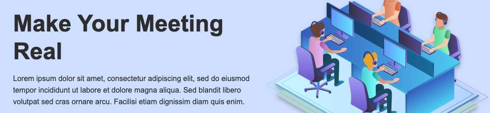
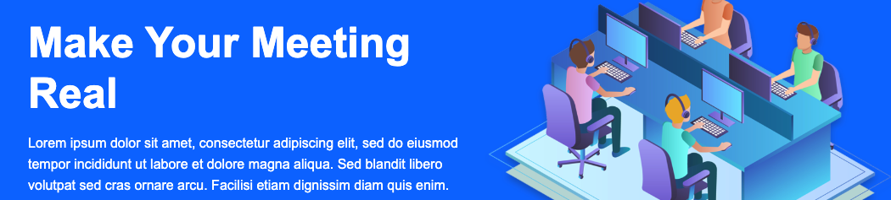

### :ribbon: sass-crash-course

#### The Doc:
- Sass Guide: [Sass Basics](https://sass.bootcss.com/guide)
- Sass Doc: [Sass Doc](https://sass.bootcss.com/documentation)

#### :eyes: The Project Demo: [demo](https://sincerity628.github.io/css-part/learn-sass/crash-course/)

---

#### :writing_hand: nesting
```scss
// _config.scss
// variables
// $var_name: value;
$primary-color: #000;
$secondary-color: #333;

// style.scss
.showcase {
  ...
  // .showcase nav
  nav {
    display: flex;
    list-style-type: none;
  }

  // .showcase-content
  // & -> parent_name
  &-content {

  }
}
```

---

#### :writing_hand: partials
- 将不同部分（功能）的样式分开成几个文件存放，可以提高样式代码可读性，逻辑性；
- 分别定义好这些文件后，在主文件中调用使用；
- 使用```@import```调用时，不同的文件之间可以互相访问其中的变量，函数，mixin；
- 更加推荐使用 ```@use``` 而不是 ```@import```，理由如下：[Heads up!](https://sass.bootcss.com/documentation/at-rules/import)


file structure
```
- scss
  |-> style.scss (main style file)
  |-> _config.scss (configuration, varialbles)
  |-> _utilities.scss (public classes)
  |-> _mobile.scss (media query)
  |-> _buttons.scss (button style)
```

style.scss
```scss
@import 'config';
@import 'utilities';
@import 'mobile';
@import 'buttons';
```

---

#### :writing_hand: function
_config.scss
```scss
// 根据背景颜色的亮暗程度调整文字的颜色
// $color -> background-color
@function set-text-color($color) {
  // check the lightness of the background
  @if(lightness($color) > 70) {
    // 如果此时背景颜色亮度大于70%，返回文字颜色为深黑灰色
    @return #333;
  } @else {
    // 背景颜色亮度小于70%，返回白色
    @return #fff;
  }
}
```

style.scss
```scss
@import 'config';

body {
  color: set-text-color($primary-color);
}
```

result:

- 当```$primary-color(background-color)```为浅色时，文字颜色为```#333（深灰）```



- 当```$primary-color```为深色时，文字颜色为```#fff（白色）```



---

#### :writing_hand: mixin

- 小函数（不返回值），具有较多重复的样式变量时使用
- 官方例子（较好）


scss:
```scss
@mixin transform($property) {
  -webkit-transform: $property;
  -ms-transform: $property;
  transform: $property;
}
.box { @include transform(rotate(30deg)); }
```

css:
```css
.box {
  -webkit-transform: rotate(30deg);
  -ms-transform: rotate(30deg);
  transform: rotate(30deg);
}
```
- 学习例子


_config.scss
```scss
// set the background & text color
@mixin set-background($color) {
  background-color: $color;
  color: set-text-color($color);
}
```

style.scss
```scss
body {
  // background-color: $primary-color;
  // color: set-text-color($primary-color);
  @include set-background($primary-color);
}
```

---

#### :writing_hand: extend
- the old way

template:
```html
<body>
  <button class="primary-btn btn">1</button>
  <button class="secondary-btn btn">2</button>
</body>
```

style.css:
```css
.btn {
  display: inline-block;
  border-radius: 5px;
  padding: 8px 20px;
  margin: 4px;
}

.btn:hover {
  transform: scale(.98);
}

.btn:focus {
  outline: none;
}

.primary-btn {
  background-color: #333;
  color: #fff;
}

.secondary-btn {
  background-color: #fff;
  color: #333;
}

```

- the new way

template:
```html
<body>
  <button class="primary-btn">1</button>
  <button class="secondary-btn">2</button>
</body>
```

_buttons.scss
```scss
// common part
%btn {
  display: inline-block;
  border-radius: 5px;
  padding: 8px 20px;
  margin: 4px;

  // .btn:hover
  &:hover {
    transform: scale(.98);
  }

  &:focus {
    outline: none;
  }
}

.primary-btn {
  @extend %btn;
  @include set-background($primary-color);
}

.secondary-btn {
  @extend %btn;
  @include set-background($secondary-color);
}
```

---

#### :writing_hand: loop
- 模仿Bootstrap里的classes: ```.ma-1 .ma-2 .my-1 my-2 mx-3 mx-4 pa-2 py-3 px-5```

_utilities.scss
```scss
// 定义变量列表
$spaceamount: (1, 2, 3, 4, 5);
// 循环生成class
@each $space in $spaceamounts:
  // margin all around
  .ma-#{$space} {
    margin: #{$space}em;
  }

  // margin top & bottom
  .my-#{$space} {
    margin: #{$space}em 0;
  }

  // margin left & right
  .ma-#{$space} {
    margin: 0 #{$space}em;
  }

  // padding...
}
```
