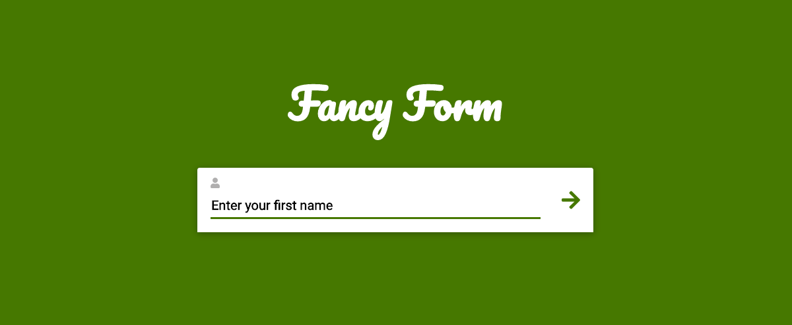
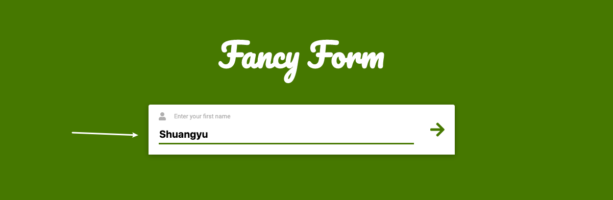
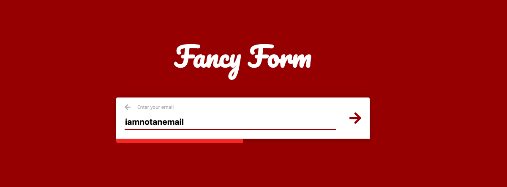
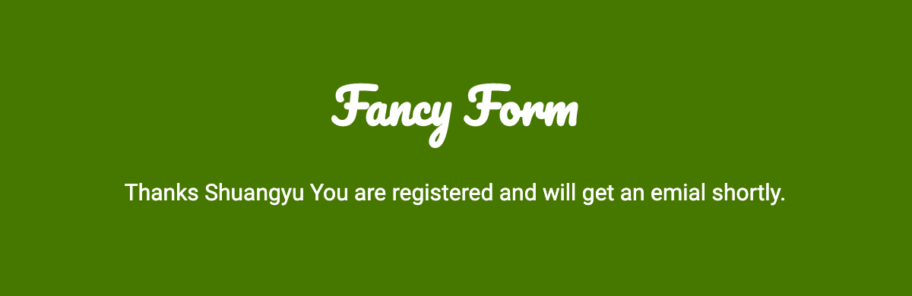

### :ribbon: Fancy Form

#### Progress:
- :white_check_mark: html & css part
- :white_check_mark: javascript part

#### :eyes: The Project Demo: [demo](https://sincerity628.github.io/css-part/learn-sass/fancy-form/)

---

a fancy form built with html, css3, sass, javascript.

#### :eyes: 首页

#### :eyes: 功能

- 填写表单

- 检查表单填写合法性（是否为空，邮箱格式）。若非法，输入框会左右抖动，相关部分的颜色也会改变

- 返回上一步

.png)

.png)

- 表单填写完成，给出提示

