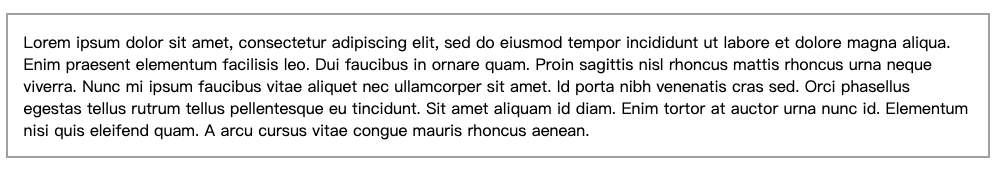
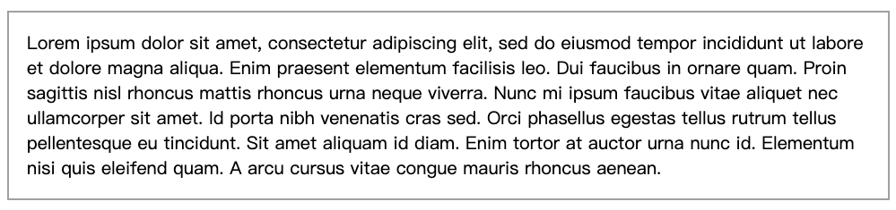

### Units rem & em

#### reference:
- Demo1: [Differences between rem, em, px, & vw/vh units](https://codepen.io/team/MedTouch/pen/YqBJzv?__cf_chl_jschl_tk__=0ce3607471fa05ef1aaebdcde5ddcb950cd6a0eb-1583658189-0-AZdbcE-KsCz696247Wi7tsZW0zFy86u_Ojz2YqofBOPD8J_my7BHPeA0CV7vUVJPnp7f-1ETL7LFVAaHs6TuRebj_zPoipqIkcCYSgZl8KalOVQCIl-5FqU_Lskvkf6haKSGVXQ_M1iG4X7FQZkxrimpwJj9UJHWhZO948ccBo0eR7A30fP9UvcU6SUyT4gdMewsGJWN21Wgokjkja0t3bFcYo1QlPDjF0l6v_av9g8K9t5ZsehW7ZiAX_aDAxMfyPHj08pEY6JeYT3YRqYfbJ4ndwL1mMenhxSTzp9xwcgx4_nnnV63Hi5Hzq2ERz-SemGBOK3kXiO9WiKR0_tIN_Jmjo2H3NNw0z30VWhqRRhU)

---

#### :writing_hand: rem
- **rem** is always relative to the root element(HTML tag).

##### 第一个例子
template:
```html
<body>
  <div class="box">
    <p>
      Lorem ipsum dolor sit amet, consectetur adipiscing elit,
      sed doeiusmod tempor incididunt ut labore et dolore magna aliqua.
    </p>
  </div>
</body>
```

style:
```css
p {
  font-size: 1rem;
}
```

result:


原因：此时```<p></p>```中的字体大小为```1rem```，因为**rem**单位和**html**标签联系，默认大小为**16px**，```1rem === 16px``` ，```2rem === 32px```

##### 第二个例子
style:
```css
html {
  font-size: 10px;
}

p {
  font-size: 2rem; /* 20px */
}
```

result:


原因：**html**标签下的默认字体大小变为**10px**，所以```<p></p>```中字体大小变为10px的两倍（20px）。

##### 第三个例子
style:
```css
p {
  font-size: 1rem; /* 16px */
  border: 0.1rem solid #aaa; /* 1.6px */
  padding: 1rem; /* 16px */
}
```

result:


##### 第四个例子
使用rem用作单位时，用户在浏览器中自定义字体大小时可以得到响应，方便适配。

- 特小字体

.png)

.png)

- 特大字体

.png)

.png)


---

#### :writing_hand: em
- **em** is relative to its nearest defined parent element
- **%** is also relative to its nearest defined parent element.

##### 一个例子
template:
```html
<body>
  <div class="box">
    <p>
      Lorem ipsum dolor sit amet, consectetur adipiscing elit,
      sed doeiusmod tempor incididunt ut labore et dolore magna aliqua.
    </p>
  </div>
</body>
```

style:
```css
.box {
  font-size: 20px;
}

p {
  font-size: 1em; /* 20px */
  border: 0.1em solid #aaa; /* 2px */
  padding: 1em; /* 20px */
}
```

result:




**注意**：**em**与其最近父亲定义了**font-size**的element有关。

---

#### :writing_hand: vh & vw

###### viewport = the browser window size.
- x vh = x% * current viewport's height
- y vw = y% * current viewport's width
